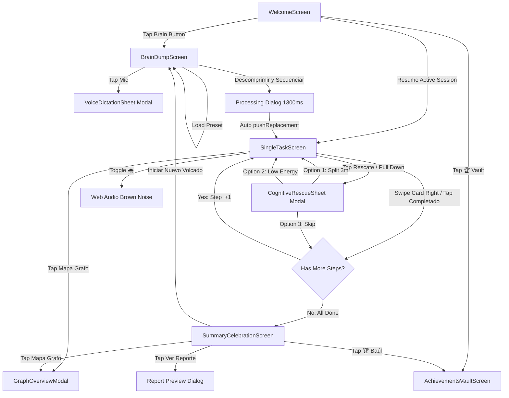

# NeuroTask Design System Specification (.stitch/DESIGN.md)

> **Document Classification**: SOURCE-OF-TRUTH RECONSTRUCTED SPECIFICATION  
> **Source Repository**: `Joni23s/NeuroTask_beta00`  
> **Target Engine**: Google Stitch / Flutter Material 3 Modernization  
> **Status**: 100% VERIFIED FROM SOURCE CODE  

---

## 1. Product Identity & Design Philosophy

### 1.1 Core Identity
* **Application Title**: `NeuroTask: Motor de Foco`
* **Sub-Brand / Department**: `DAM — ITU UNCuyo` (Desarrollo de Aplicaciones Móviles — Instituto Tecnológico Universitario, Universidad Nacional de Cuyo)
* **Target Audience**: Neurodivergent individuals, specifically users with ADHD / TDAH, executive dysfunction, cognitive fatigue, and sensory overwhelm.
* **Core Philosophy**: **"Menos ruido mental, más foco sereno."**
  1. **Strict 1-to-1 Focus**: Only ONE single task is in view at any given moment to eliminate cognitive paralysis and choice overload.
  2. **Non-Violent Chronometry (Zen Time)**: Timer tracks flow state time progressively (`"Tiempo de Flujo" | "Sin apuros"`) without countdown stress, alarms, or panic red timers.
  3. **Cognitive Rescue**: Instant de-escalation when stuck (micro-breakdown into 3-minute steps, low-energy mode reordering).
  4. **Empathetic Neuro-Affirming Reinforcement**: Dual-outcome celebratory insights (hyperfocus speed reward vs. persistence resilience reward).

---

## 2. Visual Atmosphere: Soft Paper & Soft Slate

NeuroTask utilizes an organic, calming **Tactile Soft Neumorphic Design System** built on dual-elevation ambient shadows, smooth pill curves, and soft paper/slate canvases.

* **Light Mode ("Soft Paper")**: Tactile, off-white, calm paper surface (`#F4F6F9`) with dual-directional ambient light reflections (white top-left highlight + soft slate bottom-right shadow).
* **Dark Mode ("Soft Slate")**: Deep midnight indigo-slate surface (`#131822`) reducing retinal strain with low-alpha border highlights (`rgba(255,255,255,0.08)`) and cyan/emerald glowing accents.

---

## 3. Semantic Color Tokens

### 3.1 Color Palette Table (All Values VERIFIED)

| Token Name | Hex / RGBA Value | Light Mode Semantic Role | Dark Mode Semantic Role |
| :--- | :--- | :--- | :--- |
| `background` | `#F4F6F9` | Primary Scaffold Canvas | — |
| `cardSurface` | `#F4F6F9` | Elevated Neumorphic Cards / Buttons | — |
| `pressedSurface` | `#E9EDF4` | Inset TextFields, Inset Wells | — |
| `darkBackground` | `#131822` | — | Primary Dark Scaffold Canvas |
| `darkCardSurface` | `#1C2331` | — | Elevated Slate Cards / Buttons |
| `darkPressedSurface` | `#161C28` | — | Inset Slate Wells & Text Areas |
| `brandDeepBlue` | `#2B5B84` | Primary Brand Title Typography & Isotype | Header Badge Accent |
| `brandSteelBlue` | `#4A7D9D` | Brand Subtitle & Secondary Accents | Muted Sub-brand Label |
| `brandGlowCyan` | `#38BDF8` | Active DAG Node Halo, Pulse Ring | Dark Mode Primary Title Accent & Glow |
| `brandGlowLight` | `#E0F2FE` | Soft Cyan Wash & Badges | Active Selection Indicator Wash |
| `primaryIndigo` | `#4F46E5` | Primary Action CTA, Hero Icons | Brand Action Gradient End |
| `primaryIndigoLight` | `#6366F1` | Primary CTA Gradient Start | Subtitle Highlight & Active Waveform |
| `indigoGlow` | `rgba(99, 102, 241, 0.25)` | Primary Button Ambient Elevation Glow | Hero Breathing Glow Ring |
| `successEmerald` | `#10B981` | Success Action CTA, Completed Nodes | Progress Indicators & Check Badges |
| `successEmeraldDark` | `#059669` | Success CTA Gradient End | Subtitle Confirmation Accent |
| `emeraldGlow` | `rgba(16, 185, 129, 0.25)` | Success Button & Trophy Glow | Celebration Center Card Halo |
| `amberWarning` | `#F59E0B` | Cognitive Rescue Button Accent | Low Energy / Rescue Warning Halo |
| `amberLight` | `#FEF3C7` | Micro-Step Pill Background | Warning Badge Well Background |
| `amberDark` | `#D97706` | Micro-Step Pill Typography & Icon | Validation Hint Text |
| `textMain` | `#1E293B` | High-contrast Heading & Body Text | — |
| `textSecondary` | `#64748B` | Subtitles, Instructions, Meta Information | — |
| `textMuted` | `#94A3B8` | Hints, Disabled States, Timers | — |
| `darkTextMain` | `#F8FAFC` | — | High-contrast White Text |
| `darkTextSecondary`| `#94A3B8` | — | Secondary Subtitle Slate Text |
| `darkTextMuted` | `#64748B` | — | Disabled / Inactive Node Labels |
| `borderLight` | `rgba(255, 255, 255, 0.70)`| 70% White Bevel Highlight Border | — |
| `darkBorderLight`| `rgba(255, 255, 255, 0.10)`| — | 10% White Edge Highlight Border |
| `shadowDark` | `rgba(166, 178, 196, 0.45)`| Soft Slate Ambient Depth Shadow | — |
| `shadowLight` | `#FFFFFF` | Crisp White Top-Left Reflection | — |
| `darkShadowDark` | `rgba(0, 0, 0, 0.60)` | — | 60% Black Deep Inset Shadow |
| `darkShadowLight`| `rgba(255, 255, 255, 0.08)`| — | 8% White Top-Left Ridge Glow |

---

## 4. Elevation & Neumorphic Shadow Mathematics

All elevations use dual-offset `BoxShadow` lists creating realistic tactile relief without harsh black dropshadows.

```dart
// Light Soft Elevation (Cards, Hero Containers)
[
  BoxShadow(color: Color(0x73A6B2C4), offset: Offset(6, 6), blurRadius: 14, spreadRadius: 0),
  BoxShadow(color: Color(0xFFFFFFFF), offset: Offset(-6, -6), blurRadius: 14, spreadRadius: 0),
]

// Light Subtle Elevation (Small Buttons, Badges, Pills)
[
  BoxShadow(color: Color(0x73A6B2C4), offset: Offset(3, 3), blurRadius: 8),
  BoxShadow(color: Color(0xFFFFFFFF), offset: Offset(-3, -3), blurRadius: 8),
]

// Light Pressed / Inset Elevation (Inputs, TextAreas, Tapped Buttons)
[
  BoxShadow(color: Color(0x66A6B2C4), offset: Offset(3, 3), blurRadius: 6),
  BoxShadow(color: Color(0xFFFFFFFF), offset: Offset(-3, -3), blurRadius: 6),
]

// Dark Soft Elevation
[
  BoxShadow(color: Color(0x99000000), offset: Offset(6, 6), blurRadius: 16),
  BoxShadow(color: Color(0x14FFFFFF), offset: Offset(-4, -4), blurRadius: 12),
]

// Dark Subtle Elevation
[
  BoxShadow(color: Color(0x99000000), offset: Offset(3, 3), blurRadius: 8),
  BoxShadow(color: Color(0x14FFFFFF), offset: Offset(-2, -2), blurRadius: 6),
]

// Dark Pressed / Inset Elevation
[
  BoxShadow(color: Color(0xCC000000), offset: Offset(3, 3), blurRadius: 6),
  BoxShadow(color: Color(0x0DFFFFFF), offset: Offset(-2, -2), blurRadius: 4),
]
```

---

## 5. Typography System

* **Primary Font Family**: `Plus Jakarta Sans` (via `GoogleFonts.plusJakartaSansTextTheme()`)
* **Monospace Font Family**: `Courier` / `monospace` (used for Zen Timer and Export Report)

### 5.1 Type Scale Hierarchy

| Style Identifier | Size | Weight | Line Height | Letter Spacing | Color (Light / Dark) |
| :--- | :--- | :--- | :--- | :--- | :--- |
| **Brand Hero Header** | 30px | 900 (Black) | 1.1 | 2.0px | `#2B5B84` / `#38BDF8` |
| **Brand Subtitle** | 13px | 700 (Bold) | 1.2 | 3.5px | `#4A7D9D` / `#94A3B8` |
| **Display Large (Title 1)**| 26px | 700 (Bold) | 1.2 | 0.0px | `#1E293B` / `#F8FAFC` |
| **Screen Heading (Title 2)**| 24px | 700 (Bold) | 1.2 | 0.0px | `#1E293B` / `#F8FAFC` |
| **Task Hero Title** | 20px | 700 (Bold) | 1.3 | 0.0px | `#1E293B` / `#F8FAFC` |
| **Modal Title** | 18px | 700 (Bold) | 1.2 | 0.0px | `#1E293B` / `#F8FAFC` |
| **Button Label Primary** | 15px | 700 (Bold) | 1.0 | 0.0px | `#FFFFFF` |
| **Body Large** | 14px | 400 (Regular) | 1.5 | 0.0px | `#1E293B` / `#F8FAFC` |
| **Body Medium (Subtext)** | 13px | 400 (Regular) | 1.4 | 0.0px | `#64748B` / `#94A3B8` |
| **Timer Monospace** | 12px | 700 (Bold) | 1.0 | 0.5px | `#4F46E5` / `#38BDF8` |
| **Category Pill / Badge** | 11px | 700 (Bold) | 1.0 | 1.1px | Semantic Accent Colors |
| **Meta / Hint Small** | 11px | 500 (Medium) | 1.3 | 0.0px | `#94A3B8` / `#64748B` |

---

## 6. Shape & Spacing Tokens

### 6.1 Radii
* **Hero Button Circle**: `BoxShape.circle` (Diameter: 210px)
* **Large Containers / Hero Cards / Bottom Sheets**: `36px` / `32px` / `28px`
* **Standard Cards / Insight Cards**: `24px` / `20px`
* **Buttons**: `20px` (Primary/Success), `18px` (Rescue), `14px` (Small)
* **Pills / Badges**: `16px` / `14px` / `10px`
* **Drag Indicator Bar**: `2px` (Width: 44-48px, Height: 4px)

### 6.2 Padding & Gutters
* **Screen Horizontal Gutter**: `24.0px` (or `28.0px` on Welcome)
* **Screen Vertical Gutter**: `16.0px` (or `20.0px` on Welcome)
* **Standard Card Internal Padding**: `20.0px` or `24.0px`
* **Pill Padding**: `EdgeInsets.symmetric(horizontal: 14, vertical: 6)`

---

## 7. Motion & Micro-Interactions

| Animation Name | Mechanism | Duration | Curve | Behavior |
| :--- | :--- | :--- | :--- | :--- |
| **Hero Brain Breathing** | `AnimationController` | 3200ms | `Curves.easeInOutSine` | Continuous reverse loop: scale 0.96x to 1.04x, glow opacity 0.20 to 0.55 |
| **Zen Timer Pulse** | `AnimationController` | 4000ms | Linear | Continuous reverse loop: outer indicator ring 14px to 18px |
| **DAG Node Glow Pulse** | `AnimationController` | 1800ms | Linear | Continuous reverse loop: active node ring expand 4px to 7px, alpha 0.25 to 0.50 |
| **Voice Mic Pulsing** | `AnimationController` | 1400ms | `Curves.easeInOutSine` | Dynamic scale modulated by real sound level ($0.85 + \text{level} \times 0.35$) |
| **Soundwave Visualizer** | `AnimatedContainer` (14 bars) | 70ms | Linear | Height modulates between 6px and 42px reacting to live voice input |
| **Button Press Response** | `AnimatedContainer` | 140ms | `Curves.easeOut` | Drops elevation to `pressedElevation`, changes background to `pressedSurface` |
| **Page Route Transition**| `PageRouteBuilder` | 400ms | `Curves.easeOutCubic` | Smooth `FadeTransition` without jarring slide animations |
| **Theme Icon Switch** | `AnimatedSwitcher` | 300ms | Scale | Sun/Moon scales and morphs smoothly |

---

## 8. Screen Flow & Navigation Graph


