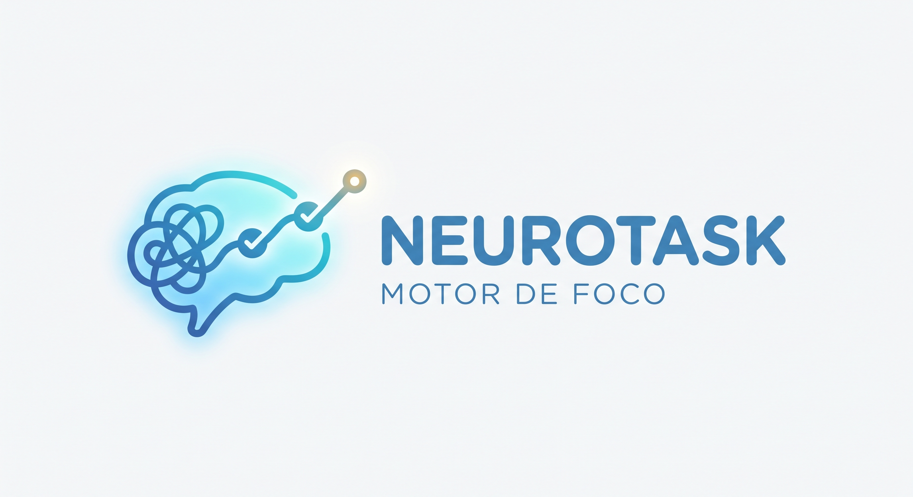

# NeuroTask: Motor de Foco 🧠✨

> **Aplicación Mobile de Descompresión Cognitiva, Secuenciación DAG y Enfoque Atómico (1 a 1)**  
> **Cátedra:** Desarrollo de Aplicaciones Móviles (DAM) — ITU, Universidad Nacional de Cuyo  
> **Trabajo Práctico:** Ejercitación - Tema 1: Diseño Centrado en el Usuario (DCU)  
> **Equipo:** Araujo Jonathan, Batiatto Juan Martín, Belardinelli Agustín, Ortega Mateo  



---

## 📌 1. Visión General del Proyecto

Las aplicaciones de gestión de tareas tradicionales (Notion, Trello, Jira) trasladan tableros complejos a pantallas reducidas, generando parálisis por análisis, sobrecarga cognitiva y disfunción ejecutiva (común en estudiantes y profesionales con TDAH o fatiga mental).

**NeuroTask** reimagina la experiencia móvil a través de:
1. **Ingesta Cruda Asíncrona (Brain Dump):** Vaciado libre de pensamientos en lenguaje natural o dictado por voz.
2. **Motor Algorítmico DAG (Directed Acyclic Graph):** Descomposición y ordenamiento topológico automático según dependencias y nivel de energía.
3. **Single-Task Focus Viewport:** Visualización estricta de una única tarea ejecutable a la vez.
4. **Módulo de Rescate Cognitivo:** Subdivisión inmediata en micro-pasos de 3 minutos o activación del Modo Baja Energía sin culpa.
5. **Estética Light Soft Paper & Soft Neumorphism:** Tonos blanco roto/gris suave (`#F4F6F9`), sombras difusas orgánicas y ausencia de alertas punitivas en rojo.

---

## 📂 2. Estructura del Repositorio

```
NeuroTask_beta00/
├── NeuroTask_logo.jpg                                       # Logotipo original
├── NeuroTask - Documento Maestro de Diseño...md             # Documento teórico completo de las 5 etapas DCU
├── README.md                                                # Documentación general y guía de ejecución
│
├── web_prototype/                                           # Prototipo Interactivo Web/Mobile de Alta Fidelidad
│   ├── index.html                                           # Simulador de smartphone interactivo
│   ├── css/style.css                                        # Design System Soft Paper & Neumorphism Tokens
│   ├── js/dag_engine.js                                     # Motor algorítmico DAG + Topological Sort
│   ├── js/audio_engine.js                                   # Motor Web Audio API (Campana Zen & Ruido Marrón)
│   └── js/app.js                                            # Lógica reactiva de estados, voz y rescate
│
├── flutter_app/                                             # Proyecto Flutter Completo (Clean Architecture)
│   ├── pubspec.yaml                                         # Dependencias (Riverpod, Google Fonts, etc.)
│   ├── analysis_options.yaml                                # Reglas de linting
│   ├── assets/images/logo.jpg                               # Asset del logotipo
│   └── lib/
│       ├── main.dart                                        # Entrypoint con ProviderScope
│       ├── core/
│       │   ├── theme/ (app_colors.dart, neumorphic_theme.dart)
│       │   ├── widgets/ (neumorphic_card.dart, neumorphic_button.dart, zen_timer.dart, flow_indicator.dart)
│       │   └── utils/ (haptic_helper.dart)
│       └── features/
│           ├── brain_dump/ (brain_dump_screen.dart, brain_dump_controller.dart)
│           ├── graph_engine/ (task_node.dart, task_graph.dart, topological_sorter.dart)
│           ├── focus_viewport/ (single_task_screen.dart, focus_controller.dart)
│           └── unblock_mode/ (cognitive_rescue_sheet.dart, graph_overview_modal.dart)
│
└── docs/
    └── FIGMA_BLUEPRINT_AND_WIREFRAMES.md                    # Blueprint para Figma y Diapositiva 6
```

---

## 🚀 3. Cómo Ejecutar el Prototipo Interactivo Web

Para abrir y probar el prototipo de forma inmediata en cualquier navegador o smartphone:

### Opción A: Servidor Local Rápido
```bash
# Desde la carpeta raíz del proyecto:
python -m http.server 8080 --directory web_prototype
```
Abrí tu navegador en: **`http://localhost:8080`**

### Características del Prototipo Web:
- 📱 **Simulación de Smartphone:** Marco de teléfono con barra de estado, notch y toggle a pantalla completa.
- 🎙️ **Ingesta por Voz & Presets:** Reconocimiento de voz y botones de ejemplo rápido.
- 🧘 **Motor de Audio Sensorial (Web Audio API):**
  - Campana tibetana suave armónica al completar tareas.
  - Generador de ruido marrón / lluvia para concentración profunda.
- ⚡ **Algoritmo DAG:** Ordenamiento topológico en tiempo real y visualizador del mapa completo de ideas.
- 🌿 **Rescate Cognitivo:** Subdivisión de tareas en micro-pasos de 3 minutos y reordenamiento de baja energía.

---

## 📱 4. Cómo Compilar y Ejecutar el Proyecto Flutter

El código en `flutter_app/` está listo para ser abierto en **VS Code** o **Android Studio**:

```bash
cd flutter_app

# 1. Obtener dependencias
flutter pub get

# 2. Ejecutar en emulador o dispositivo físico
flutter run
```

---

## 🎨 5. Figma Blueprint

Para la confección de las pantallas en Figma y el enlace público interactivo de la **Slide 6**, consultar el archivo [FIGMA_BLUEPRINT_AND_WIREFRAMES.md](docs/FIGMA_BLUEPRINT_AND_WIREFRAMES.md).
