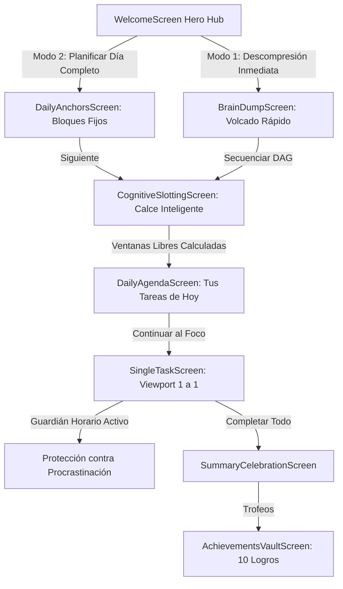

# NeuroTask Design System Specification — Versión Beta 0.1 (`beta01/DESIGN.md`)

> **Document Classification**: UNIFIED DESIGN SPECIFICATION (BETA 0.1 INTEGRATION)  
> **Source Project**: `NeuroTask: Motor de Foco` (`Joni23s/NeuroTask_beta00`)  
> **Core Architecture**: Soft Neumorphic Engine + DAG Topological Sequencing + Daily Time-Blocking Anchor Protection  
> **Target Platform**: Google Stitch / Flutter Material 3 Mobile Adaptive  

---

## 1. Product Identity, Philosophy & Unified Mental Model

### 1.1 Core Identity
* **Application Title**: `NeuroTask: Motor de Foco` (Beta 0.1)
* **Academic Affiliation**: `DAM — ITU UNCuyo` (Desarrollo de Aplicaciones Móviles — ITU, Universidad Nacional de Cuyo)
* **Target Audience**: Neurodivergent students, engineers, and creators (ADHD / TDAH, executive dysfunction, time blindness, cognitive fatigue).
* **Guiding Philosophy**: **"Menos ruido mental, más foco sereno."**

### 1.2 The Unified Dual-Flow Mental Model
In **Beta 0.1**, NeuroTask seamlessly unites two complementary cognitive workflows:



1. **Flujo de Descompresión Rápida (*On-Demand Brain Dump*)**: Para cuando la mente está colapsada con una avalancha de ideas y necesita secuenciar un camino lógico inmediato en un grafo DAG.
2. **Flujo de Rutina Diaria & Anclaje Temporal (*Daily Time-Blocking*)**: Para iniciar la mañana definiendo **Bloques Fijos Inamovibles** (*Facultad, Gimnasio, Almuerzo*) y dejar que el motor calce inteligentemente las tareas del día en las **Ventanas Libres** de menor fatiga, activando el **Guardián de Foco** para evitar la dispersión con micro-tareas.

---

## 2. Visual Atmosphere: Tactile Soft Neumorphic System

NeuroTask Beta 0.1 maintains a 100% consistent tactile visual language across all screens:

* **Light Soft Paper**: Background `#F4F6F9`, elevated surfaces `#F4F6F9`, inset wells `#E9EDF4`, crisp white specular top-left reflections (`#FFFFFF`), soft slate depth shadows (`rgba(166, 178, 196, 0.45)`), 70% white beveled perimeter highlights (`rgba(255, 255, 255, 0.70)`).
* **Dark Soft Slate**: Deep midnight background `#131822`, card surface `#1C2331`, inset surface `#161C28`, 60% black depth shadows, 8% white edge reflections, and luminous Cyan `#38BDF8` / Emerald `#10B981` accents.

---

## 3. Semantic Color Tokens

| Token Identifier | Hex / RGBA Value | Light Mode Semantic Role | Dark Mode Semantic Role |
| :--- | :--- | :--- | :--- |
| `background` | `#F4F6F9` | Canvas scaffold principal | — |
| `cardSurface` | `#F4F6F9` | Superficies neumórficas elevadas | — |
| `pressedSurface` | `#E9EDF4` | Pozos hundidos, tablas horarias, inputs | — |
| `darkBackground` | `#131822` | — | Canvas oscuro relajante para la vista |
| `darkCardSurface` | `#1C2331` | — | Tarjetas y contenedores oscuros |
| `darkPressedSurface` | `#161C28` | — | Pozos hundidos y tablas horarias oscuras |
| `brandDeepBlue` | `#2B5B84` | Tipografía principal y logo isotipo | Acento de badge en header |
| `brandSteelBlue` | `#4A7D9D` | Subtítulos de marca y etiquetas | Acento secundario |
| `brandGlowCyan` | `#38BDF8` | Halo de nodo activo y slotting engine | Acento primario en modo oscuro |
| `brandGlowLight` | `#E0F2FE` | Lavado suave en selecciones | Indicador de bloque horario activo |
| `primaryIndigo` | `#4F46E5` | Gradiente fin CTA primario ("Siguiente") | Acento primario |
| `primaryIndigoLight` | `#6366F1` | Gradiente inicio CTA primario | Ondas de voz y visualizador |
| `indigoGlow` | `rgba(99, 102, 241, 0.25)` | Resplandor del botón héroe | Halo respiratorio |
| `successEmerald` | `#10B981` | Botón "Paso Completado" y tildes | Indicadores de progreso |
| `successEmeraldDark` | `#059669` | Fin de gradiente esmeralda | Subtítulo de confirmación |
| `emeraldGlow` | `rgba(16, 185, 129, 0.25)` | Resplandor de victoria y trofeo | Halo de celebración |
| `amberWarning` | `#F59E0B` | Botón "Rescate Cognitivo" y alertas | Resplandor modo baja energía |
| `amberLight` | `#FEF3C7` | Fondo píldora micro-paso (3 min) | Pozo de advertencia empática |
| `amberDark` | `#D97706` | Texto píldora micro-paso | Texto de validación |
| `textMain` | `#1E293B` | Títulos y texto principal (Slate-900) | — |
| `textSecondary` | `#64748B` | Subtítulos e instrucciones (Slate-500) | — |
| `textMuted` | `#94A3B8` | Hints, textos de hora, estados vacíos | — |
| `darkTextMain` | `#F8FAFC` | — | Texto blanco alto contraste (Slate-50) |
| `darkTextSecondary` | `#94A3B8` | — | Subtítulos slate (Slate-400) |
| `darkTextMuted` | `#64748B` | — | Textos apagados / deshabilitados |
| `borderLight` | `rgba(255, 255, 255, 0.70)`| Bisel reflectivo blanco 70% | — |
| `darkBorderLight` | `rgba(255, 255, 255, 0.10)`| — | Bisel reflectivo blanco 10% |
| `shadowDark` | `rgba(166, 178, 196, 0.45)`| Sombra de profundidad slate | — |
| `shadowLight` | `#FFFFFF` | Reflejo especular blanco puro | — |
| `darkShadowDark` | `rgba(0, 0, 0, 0.60)` | — | Sombra de profundidad negra 60% |
| `darkShadowLight` | `rgba(255, 255, 255, 0.08)`| — | Reflejo de cresta blanco 8% |

---

## 4. Double Elevation Shadow Equations

```dart
// Light Soft Elevation (Tarjetas principales, contenedores de bloques)
[
  BoxShadow(color: Color(0x73A6B2C4), offset: Offset(6, 6), blurRadius: 14, spreadRadius: 0),
  BoxShadow(color: Color(0xFFFFFFFF), offset: Offset(-6, -6), blurRadius: 14, spreadRadius: 0),
]

// Light Subtle Elevation (Botones secundarios, píldoras, filas de horario)
[
  BoxShadow(color: Color(0x73A6B2C4), offset: Offset(3, 3), blurRadius: 8),
  BoxShadow(color: Color(0xFFFFFFFF), offset: Offset(-3, -3), blurRadius: 8),
]

// Light Pressed Elevation (Pozos hundidos, inputs de texto, botón presionado)
[
  BoxShadow(color: Color(0x66A6B2C4), offset: Offset(3, 3), blurRadius: 6),
  BoxShadow(color: Color(0xFFFFFFFF), offset: Offset(-3, -3), blurRadius: 6),
]

// Dark Soft Elevation
[
  BoxShadow(color: Color(0x99000000), offset: Offset(6, 6), blurRadius: 16),
  BoxShadow(color: Color(0x14FFFFFF), offset: Offset(-4, -4), blurRadius: 12),
]

// Dark Subtle Elevation
[
  BoxShadow(color: Color(0x99000000), offset: Offset(3, 3), blurRadius: 8),
  BoxShadow(color: Color(0x14FFFFFF), offset: Offset(-2, -2), blurRadius: 6),
]

// Dark Pressed Elevation
[
  BoxShadow(color: Color(0xCC000000), offset: Offset(3, 3), blurRadius: 6),
  BoxShadow(color: Color(0x0DFFFFFF), offset: Offset(-2, -2), blurRadius: 4),
]
```

---

## 5. Typography Scale (`Plus Jakarta Sans`)

* **Hero Brand Title**: 30px, `FontWeight.w900`, `letterSpacing: 2.0`.
* **Brand Subtitle**: 13px, `FontWeight.w700`, `letterSpacing: 3.5`.
* **Screen Display Heading**: 24px - 26px, `FontWeight.bold`, `height: 1.2`.
* **Task Card Title**: 20px, `FontWeight.bold`, `height: 1.3`.
* **Modal Title**: 18px, `FontWeight.bold`.
* **Time Monospace Stamp**: 14px (Table) / 12px (Timer), `FontWeight.bold`, `fontFamily: 'Courier'` / `monospace`.
* **Primary Button Label**: 15px, `FontWeight.bold`, text color `#FFFFFF`.
* **Body Main / Subtext**: 14px / 13px, `FontWeight.normal`, `height: 1.4 - 1.5`.
* **Category Badges**: 11px, `FontWeight.bold`, `letterSpacing: 0.8 - 1.1`.
* **Meta / Hint Small**: 11px, `FontWeight.w500`.

---

## 6. Component Architecture (Beta 0.1 Extensions)

1. **`NeumorphicButton`**: Variantes `primary` (gradiente índigo), `success` (gradiente esmeralda), `flat` (superficie con relieve sutil), `pressed` (pozo hundido).
2. **`NeumorphicCard`**: Contenedor base táctil con doble sombra, borde biselado y radio de 24-28px.
3. **`TimeSlotTableCard` [NUEVO]**: Contenedor elevado con filas internas divididas para bloques horarios (`[08:00 - 12:00] | Facultad`), con soporte para botón central `+` para añadir franjas y feedback háptico.
4. **`SwipeToCompleteCard`**: Tarjeta de foco principal con gesto horizontal (>140px) para completar y gesto vertical (>70px) para rescate cognitivo.
5. **`ZenTimerWidget`**: Cronómetro progresivo no violento (`"Tiempo de Flujo"` | `"Sin apuros"`).
6. **`DagCanvasWidget`**: Lienzo interactivo 2D con curvas Bézier y halo pulsante en el nodo activo.
7. **`CognitiveInsightCard`**: Recompensa dual neuro-afirmativa (Hiperfoco vs. Resiliencia).
8. **`FlowIndicator`**: Píldora de estado (`"Paso X de Y"`).
9. **`ThemeToggleButton`**: Selector animado Light/Dark con `AnimatedSwitcher` de 300ms.
