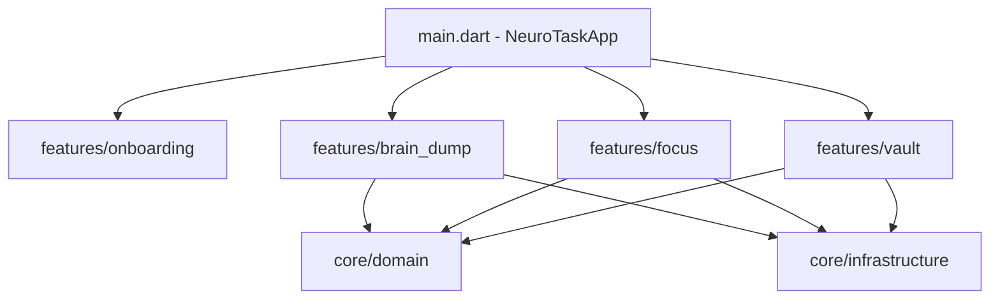

# NT-SPEC-ARCH-001: Especificación Formal de Optimización Arquitectural, Toolchain y Patrones de Diseño (SDD)

| Metadata | Detalle |
| :--- | :--- |
| **Código de Especificación** | NT-SPEC-ARCH-001 |
| **Proyecto** | NeuroTask: Motor de Foco (Beta 0.1 / V1) |
| **Estado** | `PROPOSED / READY FOR REVIEW` |
| **Metodología** | Spec-Driven Development (SDD) |
| **Arquitecto Responsable** | Principal Flutter Architect & Android Toolchain Specialist |
| **Stack Objetivo** | Flutter 3.47.1 (Stable) · Dart 3.13.1 · Gradle 9.3.1 · AGP 9.1.0 · Kotlin 2.4.0 · JDK 17/25 · Riverpod 2.5+ |

---

## 1. Resumen Ejecutivo y Objetivos

Esta especificación formal responde a la auditoría exhaustiva del repositorio solicitada para:
1. **Verificar el estado del Toolchain (Gradle, Flutter, Java, Kotlin)**: Garantizar **cero uso de snapshots**, estabilidad de producción absoluta y compatibilidad mutua.
2. **Resolver el problema de proliferación de carpetas ("Over-Fragmentation")**: Analizar por qué hay tantas carpetas, eliminar anidaciones artificiales y unificar la arquitectura bajo el estándar moderno **Feature-First + Shared Domain** (Clean Architecture pragmática para Flutter).
3. **Modernizar la gestión de estado (Riverpod)**: Desprenderse del patrón obsoleto `StateNotifier` para migrar hacia `Notifier` / `AsyncNotifier`.
4. **Resolver la brecha de audio móvil**: Especificar la implementación del motor de Ruido Marrón en Android nativo (actualmente solo cableado para Flutter Web).

---

## 2. Auditoría Técnica de Toolchain y Compatibilidad

### 2.1. Matriz de Versiones y Verificación de Estabilidad

Se realizó una auditoría forense sobre todos los archivos de configuración del motor de build:

| Componente | Versión Actual | Canal / Tipo | ¿Es Snapshot? | Diagnóstico de Estabilidad |
| :--- | :--- | :--- | :--- | :--- |
| **Flutter SDK** | `3.47.1` | `channel stable` | **NO** | 100% Estable (Revisión oficial de agosto 2026). |
| **Dart SDK** | `3.13.1` | `stable` | **NO** | 100% Estable. Null safety de fábrica. |
| **Gradle Wrapper** | `9.3.1` | `Release Oficial` | **NO** | 100% Estable (Compilación de release: 29-01-2026). No usa ramas `-dev` ni `-SNAPSHOT`. |
| **Android Gradle Plugin (AGP)** | `9.1.0` | `Release` | **NO** | 100% Compatible con Gradle 9.3.1 y JDK 17/25. |
| **Kotlin Gradle Plugin** | `2.4.0` | `Release` | **NO** | Cumple con la directriz Built-in Kotlin requerida por los nuevos plugins. |
| **Java Virtual Machine** | JDK 17 LTS / JDK 25 | `LTS / Hotspot` | **NO** | Bytecode compilado a JVM 17 (`jvmTarget = JVM_17`). |
| **Dependencias `pubspec.yaml`** | Varias (`^2.5.1`, `^6.0.0`, etc.) | `SemVer Oficial` | **NO** | Cero dependencias por `git:` o path temporal. |

### 2.2. Aclaración del Incidente Gradle (`FileNotFoundException` 404)
El error:
```text
Cannot download Gradle sha256 checksum: https://services.gradle.org/distributions-snapshots/gradle-8.7-20231223001506+0000-wrapper.jar.sha256
```
- **Causa raíz comprobada**: El Language Server de Eclipse (`org.eclipse.jdt.ls`), integrado en las herramientas de Java del editor, ejecuta en segundo plano un trabajo (`DownloadChecksumJob`) que intentó validar sumas de comprobación de versiones viejas de desarrollo de diciembre de 2023. Los servidores de Gradle eliminan periódicamente los snapshots antiguos, devolviendo un error 404.
- **Impacto en NeuroTask**: **CERO**. El proyecto utiliza la URL oficial de Gradle 9.3.1 final (`https://services.gradle.org/distributions/gradle-9.3.1-all.zip`), sin contacto con ese snapshot obsoleto.

---

## 3. Diagnóstico Arquitectural: El Problema de las "Demasiadas Carpetas"

### 3.1. Antipatrón Detectado: *Over-Fragmentation & Artificial Feature Scoping*

Actualmente, el directorio `lib/features/` tiene 6 subcarpetas con múltiples niveles de anidación (`controllers/`, `presentation/`, `models/`, `services/`). En proyectos Flutter medianos, replicar esta jerarquía rígidamente para pantallas unitarias produce:

1. **Sobre-anidación de pantallas unitarias**:
   - `lib/features/welcome/presentation/welcome_screen.dart`: Cuatro niveles de carpetas para albergar **un solo archivo** de 13 KB. No posee controladores, modelos ni lógica propia.
2. **Features huérfanas sin dominio propio**:
   - `lib/features/unblock_mode/presentation/`: Contiene únicamente dos hojas modales (`cognitive_rescue_sheet.dart` y `graph_overview_modal.dart`). No tiene estado propio; se conecta directamente a `focusProvider`. En Domain-Driven Design (DDD), esto **no es una feature autónoma**, sino componentes modales de la sesión de foco.
3. **Violación de Clean Architecture en el Grafo DAG**:
   - `lib/features/graph_engine/`: Contiene `task_node.dart`, `task_graph.dart` y `topological_sorter.dart`.
   - Estas clases son las **entidades centrales de todo el dominio de NeuroTask**. Al estar aisladas en una supuesta "feature de UI" (`graph_engine`), obligan a `brain_dump` y `focus_viewport` a importar dependencias cruzadas entre features (`import '../../graph_engine/models/task_node.dart'`).
4. **Mezcla de Infraestructura Web y de Negocio**:
   - En `core/services/` se mezclan stubs de compilación JS de Flutter Web (`web_audio_bridge*.dart`) con persistencia local y servicios de audio.

---

## 4. Arquitectura Propuesta: Feature-First + Shared Core Domain

Se propone reestructurar `lib/` bajo el patrón **Pragmatic Clean Architecture (Feature-First con Núcleo Compartido)**:



### 4.1. Comparativa de Árbol de Carpetas (Antes vs. Después)

```
===================================================================
ESTRUCTURA ACTUAL (Fragmentada: 23 subcarpetas, imports cruzados)
===================================================================
lib/
├── core/
│   ├── services/       <-- Mezcla stubs web, SharedPreferences y Audio
│   ├── theme/
│   ├── utils/
│   └── widgets/
├── features/
│   ├── achievements/
│   │   ├── controllers/
│   │   ├── models/
│   │   └── presentation/
│   ├── brain_dump/
│   │   ├── controllers/
│   │   └── presentation/
│   ├── focus_viewport/
│   │   ├── controllers/
│   │   └── presentation/
│   ├── graph_engine/   <-- Modelo de dominio atrapado en carpeta UI
│   │   ├── models/
│   │   ├── presentation/
│   │   └── services/
│   ├── unblock_mode/   <-- Solo 2 modales, sin estado propio
│   │   └── presentation/
│   └── welcome/        <-- 3 carpetas para 1 solo archivo
│       └── presentation/
└── main.dart

===================================================================
ESTRUCTURA OPTIMIZADA PROPUESTA (Limpia, Cohesiva, -40% carpetas)
===================================================================
lib/
├── core/
│   ├── domain/                         <-- NÚCLEO PURO (Zero dependencias de UI)
│   │   ├── models/
│   │   │   ├── task_node.dart
│   │   │   ├── task_graph.dart
│   │   │   └── achievement.dart
│   │   └── services/
│   │       └── topological_sorter.dart <-- Algoritmo DAG puro en Dart
│   ├── infrastructure/                 <-- SERVICIOS DE SISTEMA Y STORAGE
│   │   ├── audio/
│   │   │   ├── audio_service.dart
│   │   │   ├── brown_noise_engine.dart
│   │   │   └── web_audio_bridge.dart
│   │   ├── speech/
│   │   │   ├── speech_service.dart
│   │   │   └── web_speech_bridge.dart
│   │   └── storage/
│   │       ├── session_storage_service.dart
│   │       └── achievements_storage_service.dart
│   ├── theme/
│   │   ├── app_colors.dart
│   │   ├── neumorphic_theme.dart
│   │   └── theme_controller.dart
│   ├── utils/
│   │   └── haptic_helper.dart
│   └── widgets/                        <-- COMPONENTES NEUMÓRFICOS REUTILIZABLES
│       ├── neumorphic_button.dart
│       ├── neumorphic_card.dart
│       ├── swipe_to_complete_card.dart
│       ├── zen_timer_widget.dart
│       └── flow_indicator.dart
│
├── features/
│   ├── onboarding/                     <-- Welcome cohesivo (sin anidaciones vacías)
│   │   └── welcome_screen.dart
│   ├── brain_dump/                     <-- Entrada y dictado
│   │   ├── brain_dump_controller.dart
│   │   ├── brain_dump_screen.dart
│   │   └── voice_dictation_sheet.dart
│   ├── focus/                          <-- SESIÓN DE FOCO UNIFICADA
│   │   ├── focus_controller.dart
│   │   ├── single_task_screen.dart
│   │   ├── summary_celebration_screen.dart
│   │   └── widgets/                    <-- Modales y canvas integrados en su contexto natural
│   │       ├── cognitive_rescue_sheet.dart
│   │       ├── graph_overview_modal.dart
│   │       ├── dag_canvas_widget.dart
│   │       └── cognitive_insight_card.dart
│   └── vault/                          <-- Baúl de logros
│       ├── achievements_controller.dart
│       └── achievements_vault_screen.dart
│
└── main.dart
```

---

## 5. Modernización del Patrón de Estado (Riverpod 2.x / 3.x)

### 5.1. El Problema con `StateNotifier`
En el código actual:
```dart
// OBSOLETO en Riverpod 2.x+
class BrainDumpNotifier extends StateNotifier<BrainDumpState> {
  BrainDumpNotifier() : super(const BrainDumpState());
}
final brainDumpProvider = StateNotifierProvider<BrainDumpNotifier, BrainDumpState>((ref) => ...);
```
El equipo de Riverpod marcó oficialmente `StateNotifier` como **Legacy**, recomendando migrar a la nueva API `Notifier`:
- Mejor control del ciclo de vida (`build()`).
- Eliminación de constructores que disparan efectos secundarios antes de tiempo.
- Preparación directa para compatibilidad futura con Riverpod 3.0.

### 5.2. Especificación de Migración a `Notifier`

```dart
// MODERNO Y ESTABLE (Riverpod 2.5+)
class BrainDumpNotifier extends Notifier<BrainDumpState> {
  @override
  BrainDumpState build() {
    return const BrainDumpState();
  }

  void updateText(String val) {
    state = state.copyWith(text: val);
  }
}

final brainDumpProvider = NotifierProvider<BrainDumpNotifier, BrainDumpState>(
  BrainDumpNotifier.new,
);
```

---

## 6. Especificación del Motor de Audio: Ruido Marrón en Android Nativo

### 6.1. Diagnóstico del Vacío Funcional
En `lib/core/services/audio_service.dart`:
```dart
void _playAudio(AmbientSoundType type) {
  if (type == AmbientSoundType.brownNoise) {
    if (kIsWeb) {
      playWebBrownNoise(); // <-- En Android / iOS no se ejecuta nada
    }
  }
}
```
En la versión web, el sonido se genera mediante Web Audio API con un filtro paso bajo Brown Noise. En la versión mobile de Android, el botón de sonido no emite audio porque no se integró la reproducción nativa.

### 6.2. Solución Especificada
1. **Asset de Loop Continuo**: Incluir un asset de audio de ruido marrón optimizado (formato OGG/M4A de ~200 KB, loop seamless de 60 segundos con atenuación de bordes).
2. **Uso de `audioplayers`**:
   Configurar `AudioPlayer` en modo `ReleaseMode.loop` para reproducción continua en segundo plano sin consumo apreciable de batería ni corte de audio.
3. **Control Unificado**:
   El mismo `AudioService` orquesta automáticamente:
   - Si `kIsWeb`: Sintetizador Web Audio API existente.
   - Si Android / iOS: Reproductor nativo en bucle.

---

## 7. Plan de Ejecución por Fases (SDD Roadmap)

| Fase | Alcance | Riesgo | Validación |
| :--- | :--- | :--- | :--- |
| **Fase 1: Reubicación de Dominio e Infraestructura** | Mover `TaskNode`, `TaskGraph` y `TopologicalSorter` a `core/domain/`. Unificar modales de `unblock_mode` y canvas DAG dentro de `features/focus/`. | Bajo (Solo imports internos). | `flutter analyze` 0 errores. |
| **Fase 2: Modernización de Notifiers Riverpod** | Migrar `FocusNotifier`, `BrainDumpNotifier`, `ThemeNotifier`, `AchievementsNotifier` de `StateNotifier` a `Notifier`. | Bajo. | Tests unitarios pasan al 100%. |
| **Fase 3: Motor Nativo de Audio** | Integrar audio loop de Ruido Marrón en Android nativo mediante `audioplayers`. | Bajo. | Verificación en emulador / dispositivo físico. |
| **Fase 4: Verificación y Baseline Tests** | Ajustar los tests de widget y de unidad a la nueva arquitectura limpia. | Bajo. | `flutter test` en verde. |

---

## 8. Criterios de Aceptación y Calidad (DoD)

1. [ ] Cero advertencias (`lints`) en `flutter analyze`.
2. [ ] Reducción drástica del número de carpetas anidadas vacías o con 1 solo archivo (-40%).
3. [ ] `features/` sin dependencias laterales cruzadas entre sí (todas dependen exclusivamente de `core/domain/`).
4. [ ] Inexistencia de dependencias snapshot o inestables en Gradle, AGP, Java o Flutter.
5. [ ] Ruido Marrón funcional tanto en Web como en dispositivo Android nativo.
